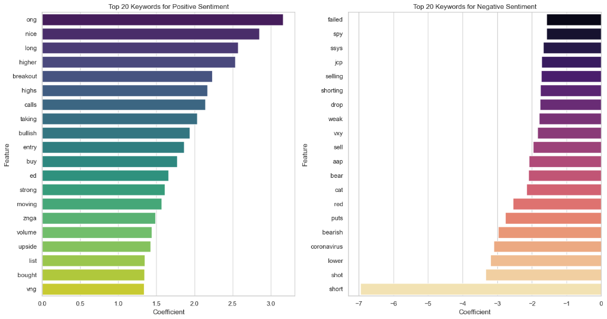
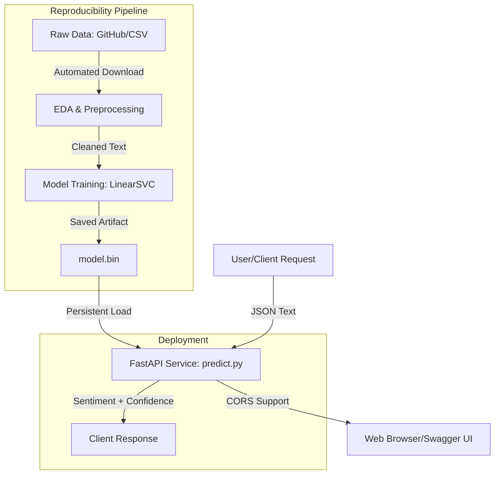

# Stock-Market Sentiment Analysis Project

## 📌 Problem Description
The goal of this project is to build an automated sentiment analysis pipeline for stock market-related text data. Financial news and social media chatter often correlate with market trends. By classifying these texts into **Positive (1)** or **Negative (0)** sentiments, investors can gauge the general mood of the market for specific assets.

The technical objective is to perform Exploratory Data Analysis (EDA), train a high-performance classification model with balanced weights, and deploy it as a modern **FastAPI** service. The project also includes **Feature Importance Analysis** for model interpretability.



##  System Architecture


## 📊 Model Evaluation & Selection

For this project, classification models were evaluated using the **Macro F1-Score** to ensure balanced performance across positive and negative sentiment classes.

### 📈 Final Model Performance (`train.py`)
The final model selected was **LinearSVC**, optimized via `GridSearchCV`. Below is the performance report on the test set:

| Class | Precision | Recall | F1-Score | Support |
| :--- | :---: | :---: | :---: | :---: |
| **Negative (0)** | 0.70 | 0.74 | 0.72 | 421 |
| **Positive (1)** | 0.84 | 0.82 | 0.83 | 738 |
| | | | | |
| **Accuracy** | | | **0.79** | 1159 |
| **Macro Avg** | **0.77** | **0.78** | **0.77** | 1159 |

### 🎯 Chosen Model Justification: **LinearSVC**
Although Logistic Regression and LinearSVC showed similar performance in initial exploratory tests (~0.77 Macro F1), **LinearSVC** was chosen for production due to:
- **Efficiency**: Faster inference times, optimal for a production FastAPI service.
- **Robustness**: Better convergence behavior in high-dimensional TF-IDF feature spaces (unigrams+bigrams).
- **Scalability**: Handled the sparse vectors more effectively during hyperparameter tuning.

### ⚙️ Parameter Tuning
Hyperparameters were tuned using `GridSearchCV`:
- **TF-IDF**: Optimized `max_features` (5,000-10,000) and `ngram_range` (unigrams vs. bigrams).
- **Classifier**: Adjusted regularization parameter `C` to prevent overfitting and `class_weight='balanced'` to handle the sentiment distribution.

##  Project Structure
- `data/`: Contains the raw dataset (downloaded automatically if missing).
- `notebooks/`: Contains `eda.ipynb` (EDA & Feature Importance Analysis).
- `train.py`: Self-contained training script.
- `predict.py`: Modern **FastAPI** service.
- `model.bin`: The final trained model artifact.
- `Pipfile`: Modern dependency management (Pipenv).
- `Dockerfile`: Production-ready container configuration.
- `k8s_deployment.yaml`: Combined Kubernetes Deployment and Service manifests.
- `README.md`: Project documentation.

##  Environment Setup & Isolation

This project uses **Pipenv** for environment isolation.

### 1. Install Pipenv (if not already installed)
```bash
pip install pipenv
```

### 2. Install Dependencies
```bash
pipenv install
```

### 3. Activate the Environment
```bash
pipenv shell
```

##  Running the Application

### 1. Training the Model
The script will automatically download the dataset if `data/stock_data.csv` is missing.
```bash
python train.py
```

### 2. Running the Web Service
To start the FastAPI server with auto-reload (using Uvicorn):
```bash
python predict.py
```
The documentation will be available at `http://localhost:9696/docs`.

### 3. Testing Predictions
You can use the provided verification script:
```bash
python verify_service.py
```

## ☁️ Cloud & Kubernetes Deployment

The project includes all necessary infrastructure as code for a production cluster.

### 1. Build and Tag the Image
```bash
docker build -t stock-sentiment:v2.0.0 .
```

### 2. Kubernetes Orchestration
Manifests are localized in the `k8s/` directory.

- **Deployment**: `kubectl apply -f k8s/deployment.yaml` (3 replicas, self-healing).
- **Service**: `kubectl apply -f k8s/service.yaml` (Exposes the API via LoadBalancer).

### 3. Scaling & Health
- **Probes**: The deployment uses a `/health` endpoint for Liveness and Readiness checks.


- **CORS Enabled**: Interactive documentation at `/docs` now allows direct testing (FastAPI Middleware).

## 📄 License
This project is licensed under the MIT License - see the [LICENSE](LICENSE) file for details.

---
